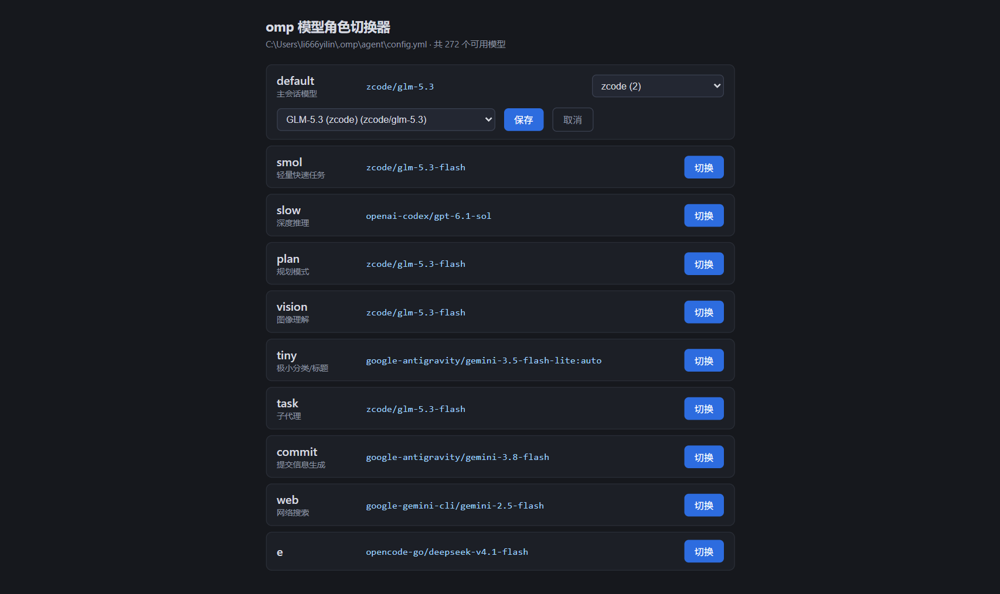
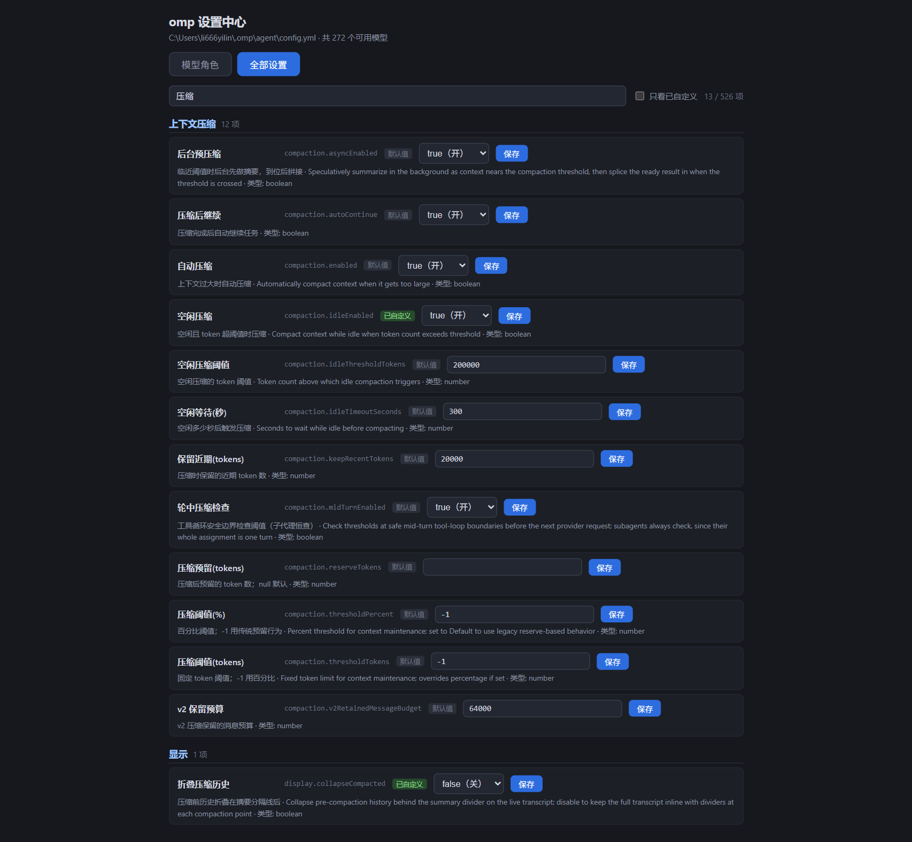

# omp 设置中心 / omp Settings Web UI

A tiny local web UI for [oh-my-pi (omp)](https://omp.sh): switch model roles and edit all settings in Chinese, by clicking.

一个本地 Web 小程序：浏览器里点击切换 omp 的 `modelRoles`、修改全部设置（中文界面），替代 TUI 内 `/model` 与手编 `config.yml`。改动写入后 omp 即时生效，无需重启会话。

| 模型角色 / Roles | 全部设置 / Settings |
|---|---|
|  |  |

## Features / 功能

**模型角色 / Model roles**

- Role matrix with two-level picker: provider group → model; auto-positions on the current value; `@role` aliases kept as a fallback entry. 两级选择（供应商分组→组内模型），自动定位当前值，别名兜底。

**全部设置 / All settings**

- Full catalog from `omp config list --json` (500+ keys) with current values, types, and descriptions. 全量设置目录，含当前值/类型/描述。
- ~200 commonly-tweaked keys have curated Chinese names & explanations; others fall back to the upstream English description. 高频设置项内置中文标注，其余回退英文描述。
- Scalar settings (boolean / number / string / enum) are editable inline; array & nested block values are shown read-only. 标量项可直接改，数组/嵌套块只读展示。
- Search + "only customized" filter; badges distinguish keys you have set from defaults. 搜索 + 只看已自定义；徽章区分自定义项与默认值。

## Requirements / 依赖

- Python 3.8+ (standard library only, zero dependencies / 纯标准库，零第三方依赖)
- [omp](https://github.com/can1357/oh-my-pi) installed and on `PATH` (used for `omp models --json`)

## Usage / 使用

```bash
python server.py            # starts http://127.0.0.1:8788 and opens your browser
python server.py --no-browser
```

Open [http://127.0.0.1:8788](http://127.0.0.1:8788), click **切换** on a role, pick a provider group, then a model, **保存**. The change applies immediately — running omp sessions pick it up, no restart needed.

打开页面 → 角色行点「切换」→ 选分组 → 选模型 → 保存。配置写入后 omp **即时生效**，运行中的会话无需重启。

## How it stays safe / 安全设计

`omp config set` rewrites the whole file and strips your comments. This tool never calls it. Instead:

1. **Targeted line edit** — reads `~/.omp/agent/config.yml` and regex-replaces only the target key's line; keys not yet present are inserted at the correct nesting level.
2. **Byte-precise I/O** — `read_bytes`/`write_bytes` with original line-ending detection (LF vs CRLF), so everything except the edited/inserted lines stays byte-identical.
3. **Automatic backup** — every write first copies the config to `config.yml.bak-role-switcher-<timestamp>`.
4. **Type validation** — values are coerced per the type reported by `omp config list` (boolean/number/string/enum); arrays and nested blocks are read-only.

Server binds to `127.0.0.1` only. Value/role inputs are validated against a whitelist regex before touching the file.

> ⚠️ Pitfall worth knowing (and the reason for #2): on Windows, Python's `Path.write_text()` silently translates LF to CRLF, which would rewrite your entire config's line endings.

## API

| Endpoint | Method | Purpose |
|---|---|---|
| `/api/state` | GET | Current roles (parsed from config.yml) + full model catalog (`omp models --json`) |
| `/api/set` | POST | `{"role": "...", "value": "..."}` — backup + targeted write |

## License

[MIT](LICENSE) — not affiliated with the omp project.
